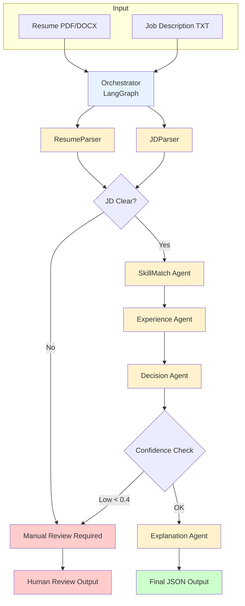

# Agentic Resume Screening System

AI-powered multi-agent system that evaluates resumes against job descriptions and recommends hiring actions with clear reasoning.

## Quick Start

```bash
git clone <repo-url>
cd agentic-resume-screening-system
python -m venv venv && source venv/bin/activate  # Windows: venv\Scripts\activate
pip install -r requirements.txt

# Setup environment (optional - works without API key using rule-based fallback)
cp .env.example .env
# Edit .env and add your GEMINI_API_KEY (free from https://aistudio.google.com/apikey)

# Run
python -m tests.test_parsers
```

---

## Architecture Overview



**Decision Points (Conditional Routing):**
| Condition | Route | Rationale |
|-----------|-------|-----------|
| Vague JD detected | → Manual Review | Can't score without clear requirements |
| Confidence < 0.4 | → Manual Review | System is uncertain, needs human judgment |
| Experience mismatch | → Flagged in output | Over/under-qualified noted in reasoning |

---

## Agent Design

| Agent | Responsibility | State Passed |
|-------|----------------|--------------|
| **ResumeParser** | Extract skills, experience from PDF/DOCX | `{skills, experience_years, projects}` |
| **JDParser** | Extract requirements from JD | `{required_skills, experience_required, jd_clarity}` |
| **SkillMatch** | Compare candidate skills vs JD | `{score, matched_skills, missing_skills}` |
| **Experience** | Evaluate experience fit | `{score, status, reason}` |
| **Decision** | Make hiring recommendation | `{recommendation, confidence, requires_human}` |
| **Explanation** | Generate human-readable reasoning | `{reasoning_summary}` |

---

## Prompt Design

We use two focused LLM prompts rather than one massive prompt:

**Resume Extraction Prompt:**
```
You are an AI recruiter assistant.
Extract structured data from the resume below.
Return ONLY valid JSON: {skills: [], experience_years: N, projects: []}
```

**JD Extraction Prompt:**
```
You are an AI recruiter assistant.
Extract structured data from the job description below.
Return ONLY valid JSON: {required_skills: [], experience_required: {min, max}, jd_clarity: "clear"|"vague"}
```

**Why this design:**
- Separate prompts = easier debugging and iteration
- Strict JSON output = reliable parsing
- "ONLY valid JSON" = reduces hallucinated text
- Clear role ("recruiter assistant") = focused responses

---

## Sample Outputs

### LLM Mode (with GEMINI_API_KEY)

**Strong Backend Candidate + Backend Python JD:**
```json
{
  "match_score": 0.96,
  "recommendation": "Proceed to interview",
  "requires_human": false,
  "confidence": 0.9,
  "reasoning_summary": "Strong skill alignment. Candidate matches most required skills such as celery, fastapi, django. Candidate experience (3 years) matches JD range (2-4 years)",
  "data_source": "LLM"
}
```

**Data Analyst (Transitioning) + Backend Python JD:**
```json
{
  "match_score": 0.52,
  "recommendation": "Reject",
  "requires_human": false,
  "confidence": 0.75,
  "reasoning_summary": "Weak skill match. Candidate is missing many core skills like django, fastapi, rest apis, microservices. Experience in data analysis, not backend development.",
  "data_source": "LLM"
}
```

### Rule-Based Fallback Mode (no API key or quota exceeded)

When LLM is unavailable, the system uses keyword extraction:

**Strong Candidate (rule-based):**
```json
{
  "match_score": 0.96,
  "recommendation": "Proceed to interview",
  "requires_human": false,
  "confidence": 0.9,
  "reasoning_summary": "Strong skill alignment. Candidate matches most required skills such as celery, rest, fastapi, ci/cd. Candidate experience (3 years) matches JD range (2-4 years)",
  "data_source": "rule_based"
}
```

**Weak Candidate (rule-based):**
```json
{
  "match_score": 0.65,
  "recommendation": "Reject",
  "requires_human": false,
  "confidence": 0.75,
  "reasoning_summary": "Weak skill match. Candidate is missing many core skills like rabbitmq, fastapi, ci/cd. Candidate experience (2 years) matches JD range (2-4 years)",
  "data_source": "rule_based"
}
```

> **Note:** Rule-based mode extracts skills via keyword matching. It works well for technical skills but may miss nuanced context that LLM mode captures.

### Vague JD (Both Modes)

```json
{
  "match_score": 0.0,
  "recommendation": "Manual Review Required",
  "requires_human": true,
  "confidence": 0.3,
  "reasoning_summary": "Job description is too vague to make an automated decision. Missing clear technical requirements.",
  "data_source": "rule_based"
}
```

---

## Error Handling

| Scenario | Behavior |
|----------|----------|
| File not found | Returns error with `requires_human: true` |
| Unsupported format | Returns error explaining supported formats |
| PDF parse failure | Graceful error, flags for human review |
| Vague JD | Routes to manual review (not a failure) |
| LLM fails/quota | Falls back to rule-based extraction |

---

## Trade-offs & Assumptions

**What we chose:**
- **Rule-based fallback** over LLM-only: Ensures system always works, even offline
- **Exact skill matching** over semantic: Simpler, debuggable, no vector DB needed
- **LangGraph** for orchestration: Conditional routing, clean state management
- **Single resume** focus: Clarity over batch processing for MVP

**What we skipped:**
- Semantic skill matching (would need embeddings + vector DB)
- Resume similarity scoring
- API endpoints (FastAPI scaffold exists but not wired)

---

## Future Improvements (What I'd Do With More Time)

### High Priority

1. **Semantic Skill Matching**
   - Use embeddings (e.g., sentence-transformers) to match "ReactJS" → "React", "Postgres" → "PostgreSQL"
   - Would eliminate false negatives from synonym/alias differences
   - Could use a lightweight vector similarity instead of exact string matching

2. **Context-Aware Skill Extraction**
   - Distinguish "Python for data analysis" vs "Python for backend development"
   - Weight skills by recency and depth of experience (mentioned in 3 jobs vs 1)
   - Extract skill proficiency levels from context clues

3. **REST API Endpoints**
   - Wire up the FastAPI scaffold for integration with ATS systems
   - Endpoints: `POST /screen` (single resume), `POST /batch` (multiple)
   - Add authentication and rate limiting

### Medium Priority

4. **Batch Processing**
   - Process multiple resumes in parallel against same JD
   - Rank candidates by match score
   - Export to CSV/JSON for recruiter review

5. **Confidence Calibration**
   - Store recruiter decisions (interview → hired/rejected)
   - Use feedback loop to adjust scoring thresholds
   - Track false positive/negative rates over time

6. **Enhanced Explainability**
   - Side-by-side comparison: "JD asks for X, candidate has Y"
   - Skill gap visualization
   - Suggested interview questions based on gaps

### Nice to Have

7. **Multi-Language Resume Support**
   - Currently assumes English resumes
   - Add language detection and translation layer

8. **Resume Quality Scoring**
   - Flag resumes with formatting issues, missing sections
   - Suggest improvements to candidates

---

## Environment Variables

| Variable | Default | Description |
|----------|---------|-------------|
| `GEMINI_API_KEY` | - | Google Gemini API key (optional) |
| `USE_LLM` | `true` | Set `false` to force rule-based mode |
| `USE_LANGGRAPH` | `true` | Set `false` to use original orchestrator |

---

> This repository is private per Pitcrew guidelines. Reviewer access via @pitcrew-hiring collaborator.
